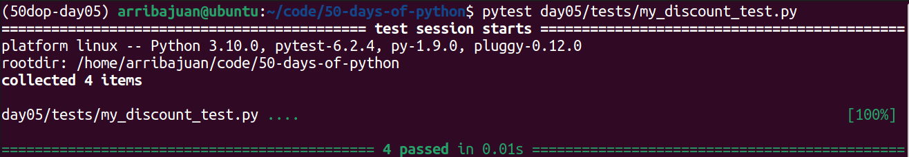
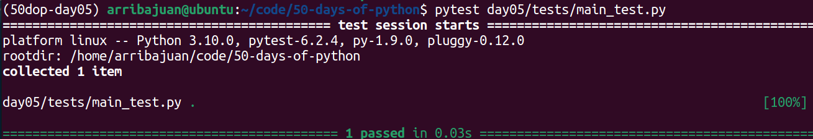
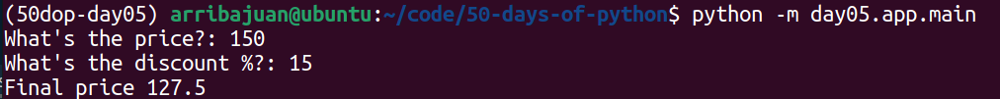

# Day 5: My discount

Create a function called my_discount.

The function takes no arguments but asks the user to input the price and the discount
(percentage) of the product.

Once the user inputs the price and discount, it calculates the price after the discount.

The function should return the price after the discount.

For example, if the user enters 150 as price and 15% as the discount, your function should return 127.5.

## Conda environment from scratch

### Create conda environment

``` bash
conda create --name 50dop-day05 python=3.10 
conda activate 50dop-day05
```

### Install libraries

``` bash
conda install -c anaconda pytest
conda install -c conda-forge typer
```

# Conda environment import / export

### Save environment to a file

``` bash
conda list --explicit > environment.txt
```

### Create environment from a file

``` bash
conda env create --file environment.txt
```

# Run tests

From the root of the codebase

## Test discount functionality

``` bash
pytest day05/tests/my_discount_test.py
```



## Test CLI app

``` bash
pytest day05/tests/main_test.py
```



# Run cli app

From the root of the codebase

``` bash
python -m day05.app.main
```




