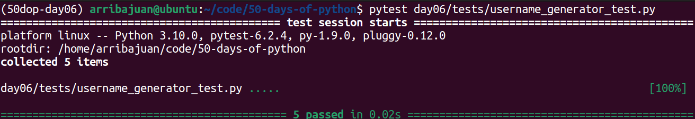
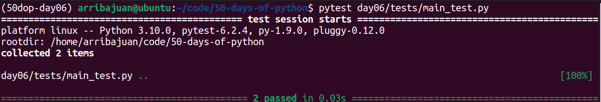
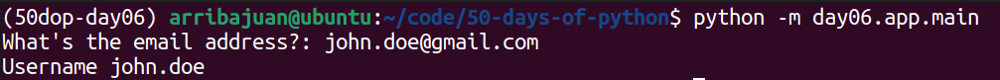

# Day 6: User Name Generator

Write a function called user_name that generates a username from the user’s email.

The code should ask the user to input an email and the code should return everything before the @ sign as their user
name.

For example, if someone enters ben@gmail.com, the code should return ben as their user name.

## Conda environment from scratch

### Create conda environment

``` bash
conda create --name 50dop-day06 python=3.10 
conda activate 50dop-day06
```

### Install libraries

``` bash
conda install -c anaconda pytest
conda install -c conda-forge typer
```

# Conda environment import / export

### Save environment to a file

``` bash
conda list --explicit > environment.txt
```

### Create environment from a file

``` bash
conda env create --file environment.txt
```

# Run tests

From the root of the codebase

## Test discount functionality

``` bash
pytest day06/tests/username_generator_test.py
```



## Test CLI app

``` bash
pytest day06/tests/main_test.py
```



# Run cli app

From the root of the codebase

``` bash
python -m day06.app.main
```


